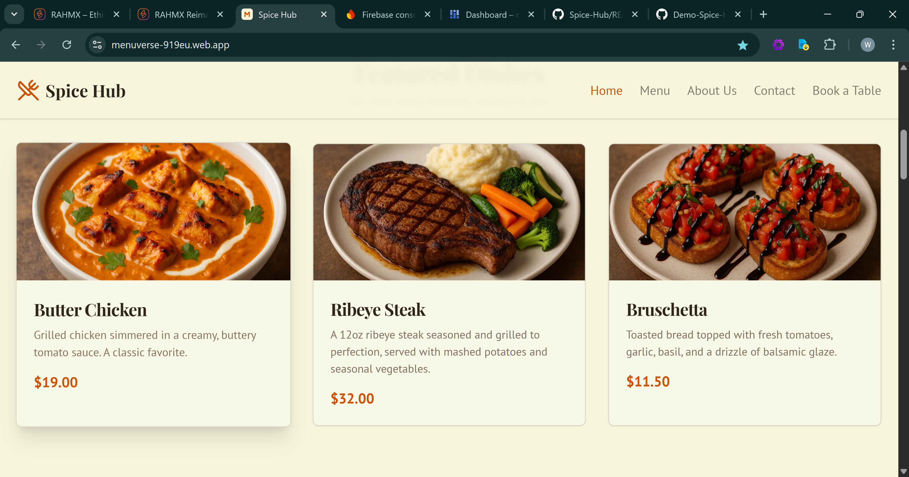
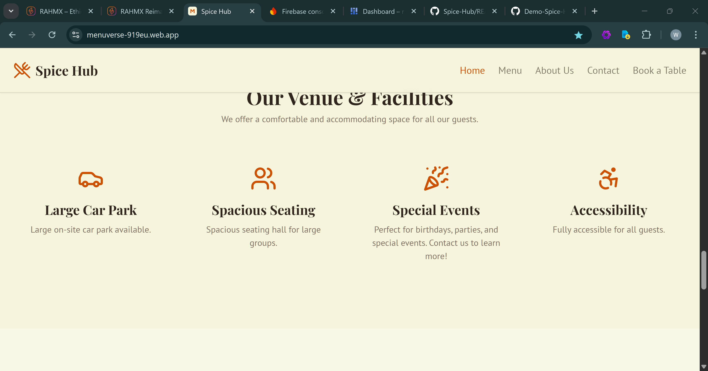
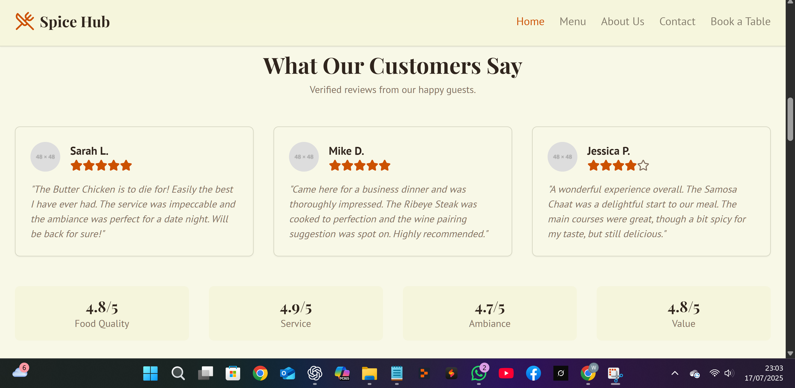
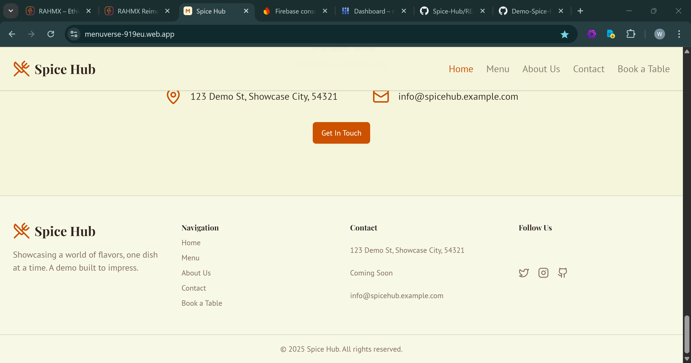
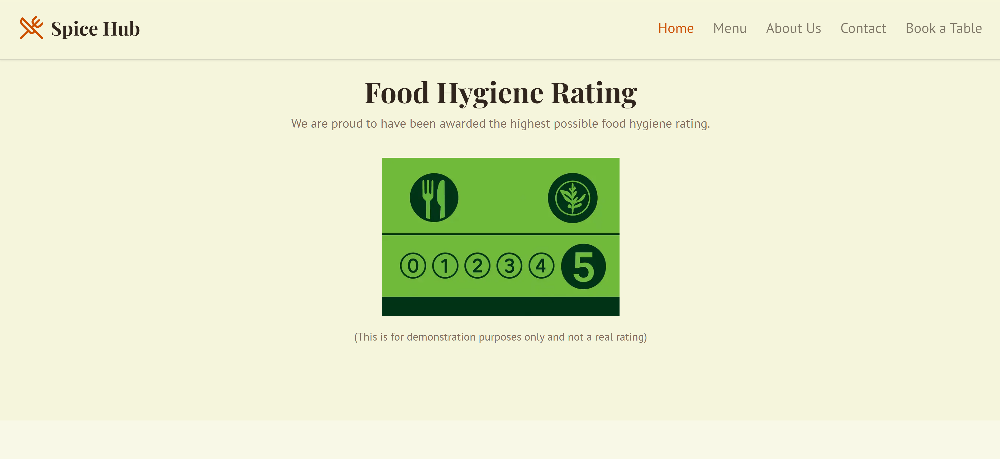

# 🌶️ Demo-Spice-Hub  
**A Restaurant Website Starter Kit by Rahmx Ltd**

This project is a professionally designed, fully responsive restaurant and small business website template built with modern tools like Next.js, Tailwind, and ShadCN UI. It is ideal for design showcases, client presentations, or starter kits for developers.

---

## 🌐 Live Demo  
👉 https://menuverse-919eu.web.app

---

## 📦 Repository  
🧾 GitHub Repo: https://github.com/devkhan1/Spice-Hub

---

## 🌟 Overview

This is a design-only demo created for presentation and customization purposes. It includes responsive page flow, themed branding, and clean UI — but no live booking, backend, or email systems.

This template was designed by **Rahmx Ltd** and is available for rebranding, licensing, and professional deployment.

### Key Highlights:

- Fully responsive layout  
- Menu showcase with categories  
- Animated section transitions  
- Visual booking section (non-functional)  
- Modular UI components using ShadCN + Tailwind  
- Firebase-ready for hosting  

💡 *Note: There is no live backend — no contact forms, bookings, or email logic in this version.*

---

## 👤 Who Is This For?

- Small business owners & startups  
- Designers seeking a clean restaurant layout  
- Developers looking for a jumpstart project  
- Agencies offering demo sites to clients  

---

## ⚙️ Tech Stack

| Tool        | Description                           |
|-------------|---------------------------------------|
| Next.js 15  | App Router with modular file system   |
| React       | Component logic and interactivity     |
| TypeScript  | Type-safe frontend                    |
| Tailwind CSS| Rapid styling and responsive design   |
| ShadCN UI   | Production-grade component library    |
| Lucide      | Elegant icon system                   |
| Firebase    | Hosting platform for the live demo    |

---

## 🧪 Local Development

```bash
git clone https://github.com/devkhan1/Spice-Hub.git
cd Spice-Hub
npm install
npm run dev
```

Then visit: http://localhost:3000

📝 Optionally create a `.env.local` file if integrating AI tools or additional backend services.

---

## 📸 Visual Previews

Selected screenshots from the live demo, stored in the [`/demo-assets/`](./demo-assets) folder.

### 🔹 Homepage


### 🔹 Featured Menu Items


### 🔹 Feature Highlights


### 🔹 Customer Reviews


### 🔹 Contact Section


### 🔹 Food Hygiene Rating Badge



## 💸 Pricing Options

### 1. Design-Only Template License

| Tier               | Price  | Use Case                                                                   |
|--------------------|--------|----------------------------------------------------------------------------|
| Spice Hub Template | £500   | For startups, creatives, or agencies wanting to adapt this frontend design. Includes static content and setup support. |

⚠️ This license does **not** include backend bookings, form integration, or authentication systems.

---

### 2. Full Custom Development & AI Integration

We offer deeper collaboration for clients needing live, intelligent features built on this foundation:

| Tier         | Price    | Ideal For                                                                |
|--------------|----------|---------------------------------------------------------------------------|
| Starter      | £2,500   | For clients needing branding + full setup + working forms                |
| Professional | £8,000   | For businesses wanting added features, e-commerce, or limited AI tools   |
| Enterprise   | £25,000+ | For platforms needing dashboards, booking logic, ZamaGPT, or VaultDNA    |

💬 *Contact us to receive a tailored proposal based on your business goals.*

---

## 🔒 Licensing

This template is licensed for demo or commercial use **with explicit permission**.

- All rights reserved by Rahmx Ltd  
- Unauthorized redistribution or resale is prohibited  
- White-label licenses available upon request  

📄 *Pitch deck or PDF breakdown available upon request*

---

## 🧠 About Rahmx Ltd

We are a boutique consultancy specializing in ethical AI systems, web architecture, and branded experiences.

| Area                 | Description                                                            |
|----------------------|------------------------------------------------------------------------|
| Web & App Development| Full-stack platforms, portals, booking systems                        |
| ZamaGPT™             | Our memory-based AI assistant for businesses                          |
| VaultDNA™            | Media storage & smart galleries with metadata + AI summary tools      |
| AI Consultancy       | Strategic planning, automation, and custom SaaS product design        |

Explore more: 🌐 https://www.rahmx.co.uk

---

## 📬 Contact

📧 Email: info@rahmx.co.uk  
🌐 Website: https://www.rahmx.co.uk

---

## 📁 Related Projects

- 🔮 DemoX-Reimagined – AI Branding Template  
  👉 Live: https://rahmx-reimagined.web.app  
  🧾 GitHub: https://github.com/devkhan1/DemoX-Reimagined

- 💼 Rahmx Ltd – Company Showcase  
  🌐 Website: https://www.rahmx.co.uk  
  🧾 GitHub: https://github.com/devkhan1/RahmX-Ltd-Demo-Showcase

---

© 2025 Rahmx Ltd — *Where Intelligence Meets Identity™*
